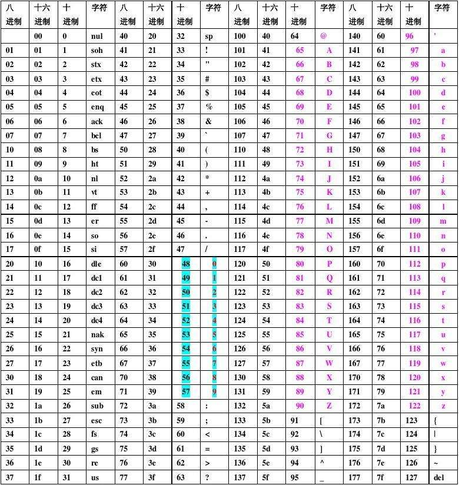

<!--blog
​	{
​		"title":"KJPush介绍",
		"described":"KJPush是一个Android推送框架，目标是让Android开发者一人无需与服务端开发者交流也能完成推送功能开发<br/>不同于现有的第三方推送服务(极光、个推、百度等)以socket长连接的形式实现推送，KJPush采用轮询机制更适合轻量级应用快速完成推送功能开发。很多人认为长连接没有任何消耗，其实不然。如果轮询策略配置的好，消耗的电与数据流量绝不比维持一个socket连接使用的多。"
	}
blog-->

KJPush介绍
============
KJPush是一个Android推送框架，目标是让Android开发者一人无需与服务端开发者交流也能完成推送功能开发<br>
不同于现有的第三方推送服务(极光、个推、百度等)以socket长连接的形式实现推送，KJPush采用轮询机制更适合轻量级应用快速完成推送功能开发。很多人认为长连接没有任何消耗，其实不然。如果轮询策略配置的好，消耗的电与数据流量绝不比维持一个socket连接使用的多。

## 欢迎你访问
* 

```java
PushManager.stopWork();
```